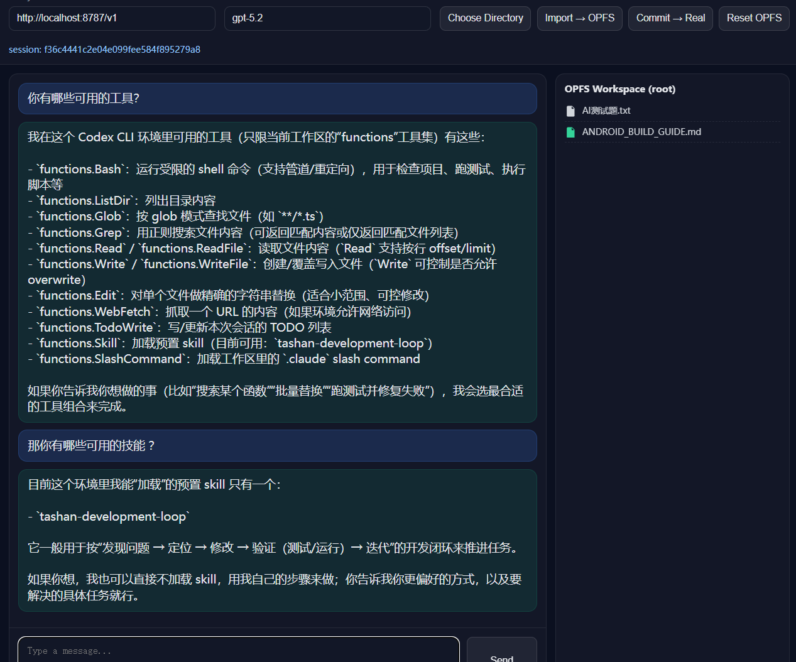

# OpenAgentic SDK（TypeScript）

一个 **tool-first（工具优先）** 的 Agent SDK 运行时，目标是在以下环境里保持尽可能一致的语义：

- 浏览器（OPFS 影子工作区）
- 服务器（在沙盒内执行宿主机原生命令）



这份仓库是 Python `openagentic-sdk` 的 TypeScript 移植版本，但会更聚焦于“让 Agent 真正跑起来”的最小核心能力：

- 事件溯源的会话（JSONL 事件日志）
- 多轮对话
- 工具调用（LLM 发起 tool call → runtime 执行 → LLM 继续）
- 影子工作区（shadow workspace）隔离工具对真实文件系统的影响
- 流式输出（provider deltas）

## 当前状态

- v1：核心原语（events/sessions/tools/workspace）
- v2：可运行的 demo + 指南（Node + Browser）

## 快速开始（Node）

前置条件：Node.js 18+、pnpm 10+、环境变量 `OPENAI_API_KEY`

```bash
pnpm install
OPENAI_API_KEY=... pnpm -C packages/demo-node start -- --project .
```

交互命令：

- `/status`：查看影子工作区与真实目录的差异概览
- `/commit`：将影子工作区的变更落盘到真实目录
- `/exit`：退出

## 快速开始（浏览器）

浏览器 demo 在浏览器内运行 Agent runtime，使用 OPFS 作为影子工作区。
由于浏览器直连 OpenAI 通常会遇到 CORS 且需要暴露 API Key，demo 通过本地代理转发请求，从而把 Key 留在本地进程里。

```bash
pnpm install
OPENAI_API_KEY=... pnpm -C packages/demo-proxy start
pnpm -C packages/demo-web dev
```

用 Chromium 系浏览器打开 Vite 输出的 URL（需要 File System Access API + OPFS）。

## 安全模型（概要）

- **影子工作区隔离：** 工具只能看到 shadow workspace；只有显式 commit 才会修改真实文件。
- **不碰 Cookies：** SDK 的网络请求默认 `credentials: "omit"`，不会自动携带 cookies。
- **浏览器不放 Key：** 不要把长期 API Key 写进前端代码；浏览器 demo 用 `packages/demo-proxy` 代管 Key。

详见：`docs/guide/security.md`

## 目录与包（workspace）

- `packages/core`：`@openagentic/sdk-core`（事件/会话/工具注册与执行/AgentRuntime/LLM 类型）
- `packages/providers-openai`：OpenAI Responses provider（JSON + SSE streaming）
- `packages/tools`：工具实现（workspace 文件工具 + `Bash`）
- `packages/workspace`：影子工作区（Memory/OPFS）+ import/commit 辅助
- `packages/workspace/node`：Node-only 的真实目录工作区（LocalDirWorkspace）
- `packages/native-runner`：宿主机原生命令执行（可选用 Bubblewrap 等沙盒后端）
- `packages/demo-node`：可运行的 Node demo（交互式）
- `packages/demo-proxy`：浏览器 demo 的本地 OpenAI 代理（CORS + Key 隔离）
- `packages/demo-web`：可运行的浏览器 demo（Vite）

## 文档

- 指南与 Quickstarts：`docs/guide/README.md`
- 项目愿景与核心设计：`docs/plan/2026-01-27-vision-and-core-design.md`
- v1/v2 执行计划索引：`docs/plan/index.md`
- v13 计划（工具链简化）：`docs/plan/v13-index.md`

## `Bash` 沙盒（有限能力）

`Bash` 始终运行在 **shadow workspace** 上，而不是宿主机文件系统。

从 v13（2026-01-28）开始，本仓库 **放弃 WASI 工具链 / bundles / registry**：Node/server 走“在沙盒内执行宿主机原生命令”，浏览器 demo 则只保留 TS-native 工具。详见：`docs/plan/v13-index.md`。

## 开发

```bash
pnpm test
pnpm build
pnpm typecheck
```
