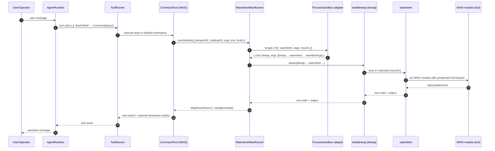
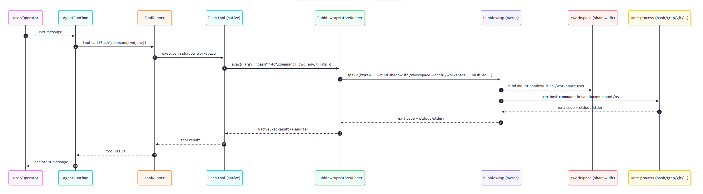

# Sandboxing

OpenAgentic SDK TS is designed around **portable tool semantics** and **defense in depth**.

## The layers

### Browser

- **Browser sandbox**: the platform sandbox already constrains processes and syscalls.
- **Shadow workspace in OPFS**: tools operate on an isolated workspace stored in OPFS (Origin Private File System).
- **Import/commit boundaries**: real filesystem access (File System Access API) happens only on explicit user actions.

### Server (default)

- **WASI sandbox**: tools run as WASI modules with only the configured preopened shadow workspace directory.
- **No Docker required**: the default server path uses a “same-semantics WASI runner” (e.g. `wasmtime`).

## Engines (server)

This repo supports (or plans) two different server-side **execution engines**:

1. **WASI engine (portable, browser-aligned)**  
   Runs signed WASI tool bundles. This is the default and the closest to “same semantics across browser/server”.

2. **Native engine (Linux-only, host tools)**  
   Runs host-native commands (e.g. `bash`, `grep`, `git`) inside a sandboxed shadow workspace. This trades away portability and browser parity for operational convenience.

### Server (optional hardening)

On the server you can add an **outer sandbox** around the WASI runner process (“sandbox stacking”):

- Inner sandbox: WASI (tool semantics)
- Outer sandbox: OS/VM sandbox (deployment hardening)

This is useful when you want stronger isolation than “only preopen the shadow dir”, without introducing a second toolchain.

## Terminology (to avoid confusion)

This project separates two concepts:

- **Execution engine**: *what* actually runs the tools (today: WASI via `wasmtime`).
- **Sandbox technology**: *how* the runner process is constrained (today: optional Bubblewrap).

Bubblewrap (`bwrap`) is a **process sandbox**. It does not run tools by itself; it wraps another program (e.g. `wasmtime`, or a native tool runner) and restricts its filesystem/network view.

So if you enable Bubblewrap in the current implementation, you will still see `wasmtime` in the execution chain — by design — because WASI is still the execution engine that keeps browser/server semantics aligned.

## Sequence diagram (server: WASI engine + Bubblewrap outer sandbox)



## Native engine (implemented in v6)

If you want Bubblewrap and WASI to be “peers” in the sense of **choosing one engine or the other**, that implies a second execution engine on the server:

- `WASI engine`: runs signed WASI tool bundles (portable; matches browser).
- `Native engine`: runs host-native binaries under a sandbox (Linux-only; does not match browser semantics unless you also ship a Linux userland bundle strategy).

This repo implements the native engine in v6 (see the diagram below). v5 focuses on the *outer sandbox adapter* so deployments can harden the WASI path (“sandbox stacking”).

## Native engine diagram (v6)

Rendered diagram for the **server native engine + Bubblewrap** flow:



## nsjail (Linux-only, optional backend)

`nsjail` is another Linux sandbox runner that can be used as an alternative backend in some deployments.

Important caveats:

- This backend is **Linux-only** and depends on kernel namespace configuration.
- Compared to Bubblewrap, the default policies you choose matter a lot; treat it as **best-effort hardening** unless you have an operator-reviewed profile.

### Ubuntu 24.04 install

```bash
sudo apt update
sudo apt install -y nsjail
```

Verify:

```bash
nsjail --help | head
```

### Smoke command

```bash
nsjail --mode o --quiet -- bash -lc "echo hello from nsjail"
```

### Integration test (skip-gated)

```bash
OPENAGENTIC_SANDBOX_INTEGRATION=1 pnpm -C packages/node test -- --run linux-sandbox.integration
```

## macOS: sandbox-exec (best-effort backend)

Some macOS versions ship `sandbox-exec`. When available, it can provide a best-effort sandbox boundary for **server-side native execution**.

Limitations:

- Availability varies by macOS version.
- It does not provide Linux-style mount namespaces; treat it as **policy-based hardening**.

Check availability:

```bash
command -v sandbox-exec
```

Smoke command:

```bash
sandbox-exec -p "(version 1)(allow default)" -- bash -lc "echo hello from sandbox-exec"
```

Integration test (skip-gated):

```bash
OPENAGENTIC_SANDBOX_INTEGRATION=1 pnpm -C packages/node test -- --run macos-sandbox.integration
```

## Bubblewrap (`bwrap`) outer sandbox (Linux-only)

Bubblewrap is a production-grade Linux sandbox based on namespaces (and commonly used by Flatpak). In this project it is treated as an *optional wrapper* around the server runner process.

## How it works (in this repo)

On the server, the WASI runner is a process spawn (`wasmtime ...`). v5 adds an optional “process sandbox adapter” that can rewrite that spawn into:

- `bwrap ... wasmtime ...` (Bubblewrap outer sandbox), or
- another sandbox technology in the future.

Key ideas:

- The runner still preopens (mounts) only the **shadow workspace** directory for WASI. This preserves “same semantics” vs browser.
- The outer sandbox constrains the **runner process itself** (filesystem view, network namespace, etc.).
- To keep the invocation correct, the wrapper must:
  1) Bind-mount host directories into stable guest paths (e.g. shadow dir → `/workspace`, runner temp → `/__runner__`).
  2) Rewrite any host paths in the inner `wasmtime` argv into their guest equivalents.

Auditing:

- When an outer sandbox wrapper is used, `WasmtimeWasiRunner.execModule()` returns `WasiExecResult.sandboxAudits` describing which wrapper ran and what it wrapped (with host-path redaction).

### What it provides

- Restricts filesystem view via bind mounts (only selected directories are visible).
- Can optionally deny network access via `--unshare-net`.
- Helps reduce blast radius of runner compromise.

### What it does not provide

- Not portable (Linux-only; depends on kernel configuration for user namespaces).
- Not a full VM boundary (kernel vulnerabilities are still relevant).
- Does not automatically make unsafe tools safe; policy + audits still matter.

### Enabling in the Node demo

Environment variables:

- `OPENAGENTIC_PROCESS_SANDBOX=bwrap`
- `OPENAGENTIC_PROCESS_SANDBOX_REQUIRED=1` (optional; fail if unavailable)
- `OPENAGENTIC_BWRAP_PATH=bwrap` (optional)
- `OPENAGENTIC_BWRAP_NETWORK=allow|deny` (optional)
- `OPENAGENTIC_BWRAP_RO_BINDS=/usr,/bin,/lib,/lib64,/etc` (optional)

If `bwrap` is unavailable or the OS is not Linux, the demo will warn and continue unless it is required.

## Ubuntu 24.04 prerequisites

Install Bubblewrap + Wasmtime:

```bash
sudo apt update
sudo apt install -y bubblewrap wasmtime
```

Verify binaries:

```bash
bwrap --version
wasmtime --version
```

Bubblewrap requires unprivileged user namespaces. On Ubuntu, this is usually enabled by default, but you can check:

```bash
cat /proc/sys/kernel/unprivileged_userns_clone
```

`1` means enabled. If it is `0`, Bubblewrap will not work for unprivileged users.

## Manual verification (no LLM required)

Run a minimal “bwrap can execute wasmtime” smoke command:

```bash
bwrap --die-with-parent --new-session \
  --proc /proc --dev /dev --tmpfs /tmp \
  --ro-bind /usr /usr --ro-bind /bin /bin --ro-bind /lib /lib --ro-bind /lib64 /lib64 --ro-bind /etc /etc \
  wasmtime --version
```

Then run the gated integration test (it will skip if `bwrap`/`wasmtime` are missing):

```bash
pnpm -C packages/wasi-runner-wasmtime test -- src/__tests__/bubblewrap.integration.test.ts
```

## Manual verification (demo-node)

If you also want to run the agent demo under Bubblewrap:

```bash
OPENAGENTIC_PROCESS_SANDBOX=bwrap \
OPENAI_API_KEY=... \
pnpm -C packages/demo-node start -- --project . --once "Use Bash to run: echo hi"
```

## Native engine (demo-node)

To run `Bash` using host-native tools under Bubblewrap (Linux-only):

```bash
OPENAGENTIC_TOOL_ENGINE=native \
OPENAI_API_KEY=... \
pnpm -C packages/demo-node start -- --project . --once "Use Bash to run: echo hi"
```

Notes:

- Native engine uses host `bash`/`grep`/etc. Tool availability and behavior depends on the host.
- Default recommendation is to deny network in Bubblewrap: `OPENAGENTIC_BWRAP_NETWORK=deny`.
