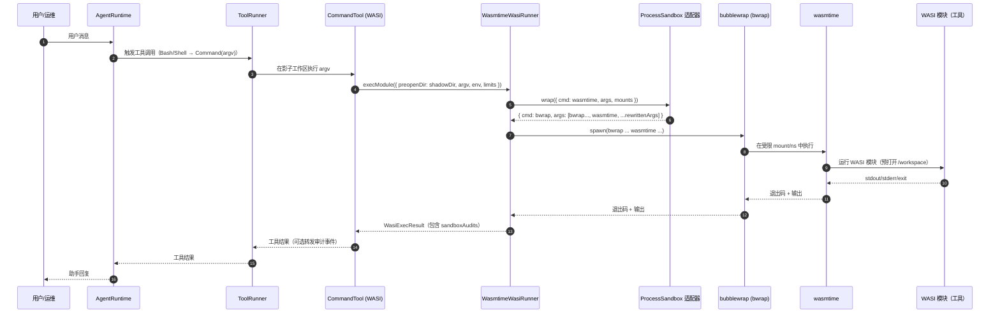

# 沙箱（Sandboxing）

OpenAgentic SDK TS 的目标是同时做到两件事：

- **工具语义可移植**（同一套 tool bundle 在浏览器/服务器上尽量一致）
- **纵深防御**（Defense in depth，在关键边界叠加多层隔离）

## 分层模型

### 浏览器侧

- **浏览器沙箱**：平台本身已经限制了进程/系统调用等能力。
- **OPFS 影子工作区**：工具只在 OPFS（Origin Private File System）里的影子工作区上读写。
- **导入/提交边界**：真实文件系统（File System Access API）只在明确的用户动作下访问（Import/Commit）。

### 服务器侧（默认）

- **WASI 沙箱**：工具以 WASI 模块执行，只能看到预先打开（preopen）的影子工作区目录。
- **不需要 Docker**：默认路径是“同语义 WASI runner”（例如 `wasmtime`）。

### 服务器侧（可选加固）

在服务器上可以再加一层 **外层沙箱**，把 WASI runner 进程包一层（“沙箱叠加 / sandbox stacking”）：

- 内层：WASI（工具语义、跨平台一致性）
- 外层：OS/VM 沙箱（部署级加固）

这样做的价值是：在不引入“第二套工具链”的前提下，获得更强的进程级隔离能力（文件系统视图、网络命名空间等）。

## 时序图（服务器侧 + Bubblewrap）



## Bubblewrap（`bwrap`）外层沙箱（仅 Linux）

Bubblewrap 是基于 Linux namespaces 的生产级沙箱工具（Flatpak 的核心原语之一）。在本项目里，它被当作 **可选的“外层包装器”**：用于包住 `wasmtime` 这个 runner 进程，而不是替代 WASI。

## 本项目里它是怎么工作的

在服务器上，WASI runner 本质上就是一次进程 spawn（`wasmtime ...`）。v5 增加了一个可插拔的 “process sandbox adapter”，它可以把这次 spawn 改写为：

- `bwrap ... wasmtime ...`（Bubblewrap 外层沙箱），或
- 未来的其它沙箱技术（同一个适配器契约）。

为了保证命令能正确执行，包装器需要做两件关键事情：

1) **把宿主机目录 bind 到稳定的“沙箱内路径”**
   - 影子工作区：宿主机的 shadow dir → 沙箱内 `/workspace`
   - runner 临时目录：宿主机 tmp → 沙箱内 `/__runner__`
2) **重写 `wasmtime` 的 argv**
   - 把 argv 里出现的宿主机路径改成对应的沙箱内路径（否则 `wasmtime` 在沙箱里找不到文件）。

审计（Auditing）：

- 当启用了外层沙箱包装器，`WasmtimeWasiRunner.execModule()` 会返回 `WasiExecResult.sandboxAudits`，描述“用了哪个包装器”以及“包装后的命令”（并对宿主机路径做脱敏/替换）。

## 它能提供什么

- 通过 bind mount 限制进程能看到的文件系统视图（只暴露指定目录）。
- 可选通过 `--unshare-net` 禁用网络（更强隔离）。
- 在 runner 被攻破时，进一步降低爆炸半径（相比只靠“preopen 影子目录”更硬）。

## 它不能提供什么

- 不可移植：仅 Linux 可用，且依赖内核/系统对 unprivileged user namespaces 的配置。
- 不是完整 VM 边界：内核漏洞仍然是风险面。
- 不会自动让“不安全工具”变安全：仍需要权限、审计、策略等配套。

## Ubuntu 24.04 前置安装

安装 Bubblewrap + Wasmtime：

```bash
sudo apt update
sudo apt install -y bubblewrap wasmtime
```

验证二进制：

```bash
bwrap --version
wasmtime --version
```

Bubblewrap 依赖 unprivileged user namespaces（普通用户可用的 userns）。一般 Ubuntu 默认开启，但你可以检查：

```bash
cat /proc/sys/kernel/unprivileged_userns_clone
```

输出 `1` 表示开启；如果是 `0`，普通用户下 Bubblewrap 可能无法工作。

## 手工验证（不需要 LLM）

最小 smoke：验证 `bwrap` 能在沙箱里运行 `wasmtime`：

```bash
bwrap --die-with-parent --new-session \
  --proc /proc --dev /dev --tmpfs /tmp \
  --ro-bind /usr /usr --ro-bind /bin /bin --ro-bind /lib /lib --ro-bind /lib64 /lib64 --ro-bind /etc /etc \
  wasmtime --version
```

然后跑集成测试（如果本机缺少 `bwrap`/`wasmtime` 会自动跳过）：

```bash
pnpm -C packages/wasi-runner-wasmtime test -- src/__tests__/bubblewrap.integration.test.ts
```

## 手工验证（demo-node）

如果你想把 agent demo 也跑在 Bubblewrap 外层沙箱里：

```bash
OPENAGENTIC_PROCESS_SANDBOX=bwrap \
OPENAI_API_KEY=... \
pnpm -C packages/demo-node start -- --project . --once "Use Bash to run: echo hi"
```

相关环境变量：

- `OPENAGENTIC_PROCESS_SANDBOX=bwrap`
- `OPENAGENTIC_PROCESS_SANDBOX_REQUIRED=1`（可选：不可用就直接失败）
- `OPENAGENTIC_BWRAP_PATH=bwrap`（可选：指定 bwrap 路径）
- `OPENAGENTIC_BWRAP_NETWORK=allow|deny`（可选：是否禁网）
- `OPENAGENTIC_BWRAP_RO_BINDS=/usr,/bin,/lib,/lib64,/etc`（可选：额外 ro-bind 列表）

