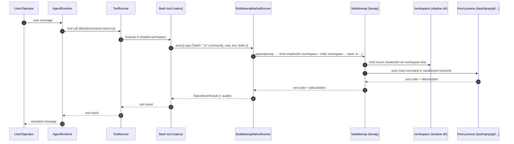

# v6 Plans Index — Bubblewrap-Native Execution Engine (Linux-only)

> Goal of v6: add a **second server-side execution engine** that runs host-native commands under Bubblewrap, without shipping any tool bundles. This is intentionally Linux-only and intentionally not “same semantics” as the browser WASI toolchain.

## Execution model (timing + technical principle)

v6 does **not** introduce complex IPC. The native engine is simply:

- Node `spawn()` → `bwrap` → `bash -lc "<script>"` (or another host command)
- stdin/stdout/stderr are connected via normal pipes
- the tool result is built from exit code + captured stdout/stderr (with limits)

The key isolation boundary is the Bubblewrap mount namespace: the child process only sees what is bind-mounted.

### Sequence diagram (server: native engine + Bubblewrap)

## Performance expectations

The dominant overhead for tiny commands is **process startup** (one `spawn()` per tool call). On modern machines this is usually “fast enough” for real work, but can feel slow if the agent emits many tiny commands.

v6’s guiding principle is: **ship the native engine first**, then optimize.

See `v6-feature-05-performance-optimizations.md` for planned follow-ups (batching commands, long-lived sessions, etc.).

## Why v6 exists

v4/v5 establish a portable, WASI-first toolchain and allow extra hardening by wrapping the WASI runner process (e.g. `bwrap ... wasmtime ...`).

Some deployments want a different tradeoff:

- Use host-native tools (`/bin/bash`, `grep`, `git`, etc.)
- Still keep **shadow workspace isolation** and process sandboxing (Bubblewrap)
- Accept Linux-only portability and accept that browser parity is not guaranteed

This requires a separate execution engine, not just an “outer sandbox wrapper”.

## v6 success criteria (hard)

- A `NativeRunner` contract exists (argv + stdin + env + cwd + limits + audit).
- A `BubblewrapNativeRunner` implementation exists (Linux-only) that can:
  - mount the shadow workspace as `/workspace`
  - set cwd safely
  - optionally disable network
  - cap output size + enforce timeouts
- A `Bash` tool can run using the native engine (host `/bin/bash`), including pipelines/redirection (because host bash).
- `demo-node` can select `engine=wasi|native` with env/config flags.
- Security docs clearly explain the tradeoffs vs WASI.

## Execution order (recommended)

1. `v6-feature-00-native-runner-contract.md`
2. `v6-feature-01-bubblewrap-native-runner.md`
3. `v6-feature-02-native-bash-tool.md`
4. `v6-feature-03-demo-node-engine-switch.md`
5. `v6-feature-04-docs-security-tradeoffs.md`
6. `v6-feature-05-performance-optimizations.md` (follow-ups)
